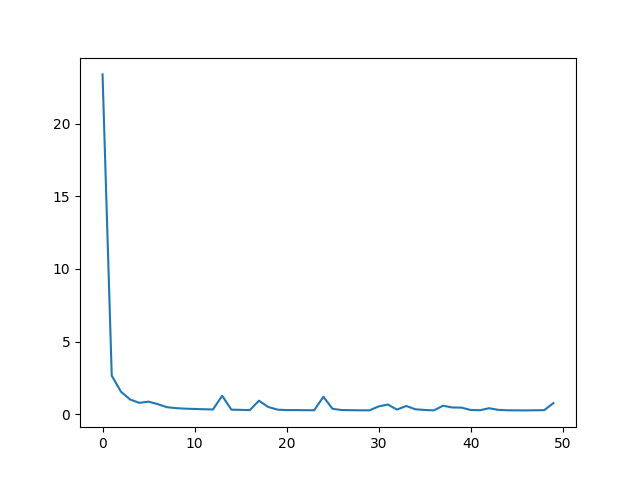
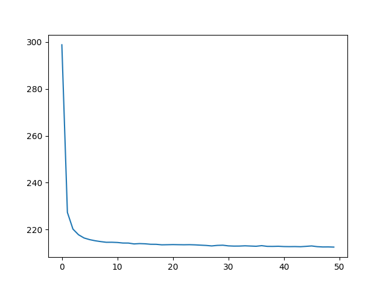

# Incremental-Language-Identification
Train RNN model in PyTorch to identify a language in as few characters as possible

## Languages used
The languages that I trained the model over for this assignment are as follows:

- Urdu
- Arabic
- Persian
- Hindi
- Egyptian Arabic
- Swedish
- Finnish
- Danish
- German
- English.

The first five languages in this list are either very similar to each other (for example Urdu, Hindi and Persian), or/and have very similar roots. I wanted to investigate how difficult it is for a recurrent model to differentiate between them. The first three of the next five languages are Scandanavian, and I wanted to see how well the model can distinguish amongst them, as well as with German and English. My expectations are that the model should not have a hard time differentiating any of the first five languages with the next languages, but it will face more difficulty differentiating amongst the first five or the last five languages.

These languages are specified by their "ISO 369-3" code in the `config.py` file, and you can specify any language here, as well as any number of languages. I have designed the scripts to hopefully be generic enough to be handle this.

### Generating smaller train-test files as per specified languages
The repository contains the following train-test files:

- x_train_subset_langs.txt
- y_train_subset_langs.txt
- x_test_subset_langs.txt
- y_test_subset_langs.txt

These files have been generated as per the languages mentioned above, using the `data_preparation.py` script. If you want to run the project for a different set of languages, please specify the languages in `config.py`, and then run the `data_preparation.py` script to generate the smaller train-test files as per the languages that you have specified.

## Network Architecture
The network architecture is specified in the `GRUNet.py` file. It contains an embedding layer which takes the vocabulary size (this increases as more languages are added of course), and creates embeddings of 200 dimensions, or as specified in `input_size`. These embeddings are then fed to the GRU layer, which has a layer size of 1 and a hidden size of 300, or as specified in `hidden_size`. The output of this layer is finally fed to a linear layer, the output of which is equal to the number of languages specified in `output_size`. I do not apply a Softmax or LogSoftmax function at the end to get prediction probabilities, as the loss function I'm using is CrossEntropyLoss, and it calculates the softmax itself. 

In order to make the network architecture somewhat configurable, I have specified the input size, hidden size, number of layers for GRU, dropout for GRU and learning rate for the optimizer in the `config.py` file, and they can be changed from there to experiment with different configurations.

## Training the model
The main script to train the model is `train_model.py`. It accepts the following command line arguments:

- `-X` --> the path to the file containing the language sentences to be used for training. This is a string value.
- `-Y` --> the path to the file containing the language labels to be used for training. This is a string value.
- `-E` --> the number of epochs to be used for training the model. This is an integer value.
- `-L` --> the loss function to be used for training the model. This is an integer value that can accept a value of 1, 2 or 3. Their functions are as follows:
	- 1 = use normal CrossEntropyLoss without character length factored in
	- 2 = CrossEntropyLoss with character length percentages multiplied with respective losses
	- 3 = CrossEntropyLoss with character length percentages added to respective losses.
- `-F` --> the option to specify whether the vocabulary should be loaded from disk if found, or a new one should be generated from scratch. This is because during the generation of the vocabulary, the `set` object is used, which is an unordered list. Therefore, everytime the training script is run, a different vocabulary mapping object is saved to disk - different because of the indices assigned to words. Because of this, keep in mind that whenever the training script saves a vocabulary mapping object to disk, that *same* vocabulary mapping object must be loaded by the testing script, otherwise the indices will be messed up. To get around this hassle, I provided this functionality, where you can run the training script once for any set of languages, which would save the vocabulary mapping object to disk, and then this object can be loaded from disk everytime you rerun the training or testing scripts, instead of generating the vocabulary mapping anew everytime. Of course, if you want to run the training script on a different set of languages, you would have to generate the vocabulary mapping object again. Also, if no existing vocabulary mapping object is found on disk, then a new one will be generated. This command line parameter can have two values:
	- 0 = Do not generate new vocab_mapping and vocabulary
	- 1 = Generate new vocab_mapping and vocabulary

**Sample command**:
`python3 train_model -X x_train_subset_langs.txt -Y y_train_subset_langs.txt -E 250 -L 1 -F 0`

### Specifying batch size
To specify the batch size, you can specify the value in the `BATCH_SIZE` parameter in the `config.py` file. If you don't want to use batches, please set the batch size here to 1. It is suggested to use batching, however, as I have found it to improve the model performance. It also helps bring down the loss faster, as the model is not being updated by every individual instance, but rather every batch of instances.

### Training process

#### Loading the data
The training of the model happens as follows: First, a language label to integer mapping is created for the languages specified in the config file. Then, data is loaded from the sentence data and sentence label files specified in the command line arguments. While loading the sentences, they are each limited to their first 100 characters. A training and validation split is created on this data, with 80% of the data being used for training, and the remaining 20% to be used for validation. Once the model has been trained, I test the model on the validation data using the same testing function that I use for the test data, which is described later on.

#### Generating vocabulary and vocabulary-to-integer mapping
The vocabulary and vocabulary-to-integer mapping is generated using all sentences (training as well as validation). This is to ensure that the validation data doesn't have any characters that there isn't a character-to-integer mapping for. This mapping is initialized from 1 instead of 0, since 0 is reserved for the padding character, and its size is equal to the number of unique characters in the sentences present in the data. 

#### Clipping sentences
Clipped versions of each sentence in the training data are then generated, with the clipping length specified to 100. This means that for each sentence in the training data, 100 sentences are generated, where the first sentence contains only the first character, the second sentence contains only the first two characters, and so on until the length of the sentence (which is always 100 as the sentences are limited to their first 100 characters). This means that we get a lot more training sentences, and the labels are multipled accordingly - I also thought that this can be looked upon as a form of data augmentation, but I'm not too sure about this.

#### Getting numeric representations of sentences
The next step is to get the numeric representations of each sentence, where in each sentence, every character is replaced by its numeric representation as specified in the vocabulary-to-integer mapping. This is a relatively straightforward process, and I have added the condition that if the numeric mapping for any character is not found, then its numeric representation is 0. This is done so that if the test data contains a character for some language that is not present in the training language, it shouldn't contain the script. Additional thoughts: Perhaps this replacement character should not be 0 since that's the padding character, but maybe something like the length of the vocabulary + 1. However, I did not face this scenario in the testing enough to test this altered version of replacement character.

#### Padding sequences
Finally, the numeric representations of sentences are padded using PyTorch's built-in `pad_sequence` function, so we now get sequences of 100 characters length each, where sentences having less than 100 characters are padded to the right by zeros. This is the final transformation done to the data, and it can now be fed into the network for training.

#### Shuffling and generating batches
For shuffling the data and generating batches, I used PyTorch's `DataLoader` functionality. I had to create a separate class for it (specified in `Dataset.py`), which extends `torch.utils.data`, and I overrode the `__init__`, `__len__` and `__getitem__` functions. To use this, I created a generator for the training data using this class, and fed it the padded sequences and labels for the training data. The batch size I specified here is the same that is present in the `config.py` file. 
*Note:* I tried implementing batching myself first, but I ran into a lot of problems, and then found that learning how PyTorch's DataLoader functionality was both more convenient, and more efficient.

#### Loss function types
The network is initialized using the configurations specified both in the command line parameters as well as the config file, along with the optimizer and loss function (note that the loss function is initialized with reduction set to 'none' in the case of loss function types 2 and 3), and then it is trained over the batches generated by the training generator. 
	
	- If the loss function type is 1, I calculate the loss as normal.
	
	- If the loss function type is 2, I calculate the loss as normal, which returns me the individual losses of all instances present in the specified batch. To each loss value, I multiply the respective character length percentages (which I calculate by getting the number of non-zero elements in the padded sequence, and dividing it by 100), and then take the mean of the loss at the end.
	
	- If the loss function type is 3, loss calculation happens in the same manner as in loss function type 2, except that the character length percentages are added to the respective losses instead of being multiplied by them.

The loss values are calculated after each epoch, and are added to a list to be used for plotting the loss later.

**NOTE**: For the custom loss function types 2 and 3, I also experimented halfway with the idea of creating a separate network which simply takes an input of dimension 1 and returns an output of 1, and updating it through the same loss function. However, I found the other approach (the one I've used) easier, plus as per Asad's comments in the discussion forum for this assignment, "the most likely thing to happen is that mm will tend to 0 as the network learns to ignore the penalty and focus on accuracy", I found it worthwhile to invest in the other approach first.

#### Saving required objects to disk
Finally, the trained model, the vocabulary-to-integer mapping, and the language-label-to-integer mapping are saved to disk, as well as a plot of the training loss. The path and name for these are all specified in the config file, and can be changed.

### Results

Initially when I was training the model, I initialized the hidden layer for the GRU in the forward pass, and discarded the returned hidden state from the GRU layer. With this setup, I had roughly the same accuracy from all 3 models. However, later I thought that initializing the hidden layer inside the forward pass maybe doesn't make a lot of sense, since this way we just initialize a hidden layer with zeros for every batch, and immediately discard it afterwards. I then went for a different configuration, in which I initialized the hidden layer once per epoch, and passed that to the forward pass. Additionally, I updated this hidden layer with the hidden layer returned by the GRU layer. This way, the model is using the hidden weights that it is learning from each batch, and using them for the next batch. I don't know if this way is correct for this specific application, but I think intuitively this makes a lot more sense for a recurrent network setup. With this setup however, the training losses and accuracy on testing data for all three loss functions remained more or less the same. 

Here are some overall stats:

|                                  				  | LF 1   | LF 2   | LF 3     |
|-------------------------------------------------|--------|--------|----------|
| Training Loss                    				  | 10.62  | 0.76   | 212.48   |
| Model accuracy (validation data) 				  | 74.79% | 83.81% | 74.03%   |
| Model accuracy (testing data)    				  | 73.24% | 85.23% | 72.38%   |
| Avg no. of chars until hit score (testing data) | 3.37   | 4.78   | 3.66     |
| Learning rate                    				  | 0.0005 | 0.0005 | 0.0005   |
| No. of epochs                    				  | 50     | 50     | 50       |

#### Results on validation data:
##### LF 1

| Language        | Accuracy           |
|-----------------|--------------------|
| Urdu            | 80.32075471698114  |
| Arabic          | 75.72043010752688  |
| Farsi           | 75.24731182795699  |
| Swedish         | 66.67              |
| Finnish         | 74.89130434782608  |
| Egyptian Arabic | 56.111111111111114 |
| Danish          | 63.91588785046729  |
| German          | 72.87755102040816  |
| English         | 81.75280898876404  |
| Hindi           | 99.68421052631578  |

##### LF 2

| Language        | Accuracy           |
|-----------------|--------------------|
| Urdu            | 93.8 			   |
| Arabic          | 74.02830188679246  |
| Farsi           | 93.87619047619047  |
| Swedish         | 78.85185185185185  |
| Finnish         | 86.93617021276596  |
| Egyptian Arabic | 69.26262626262626  |
| Danish          | 76.35779816513761  |
| German          | 87.28155339805825  |
| English         | 83.89887640449439  |
| Hindi           | 96.36956521739131  |

##### LF 3

| Language        | Accuracy          |
|-----------------|-------------------|
| Urdu            | 78.99056603773586 |
| Arabic          | 70.53  			  |
| Farsi           | 86.16326530612245 |
| Swedish         | 66.9158878504673  |
| Finnish         | 71.15596330275228 |
| Egyptian Arabic | 54.52941176470588 |
| Danish          | 62.32692307692308 |
| German          | 79.01282051282051 |
| English         | 75.9381443298969  |
| Hindi           | 97.72727272727273 |

- I kept the number of epochs small because the loss goes down rapidly in the first few epochs, and then improvements to the loss become very small and slow. As such, running the model over 50 epochs vs. 250 epochs did not have a major impact on any model's performance.

- All models were trained on the same training files, with the same configuration such as number of epochs, learning rate, number of hidden layers etc.

- The training loss of LF 2 being the lowest makes sense, given that we are multiplying a numvber smaller than 0 with most of the individual loss values, thus effectively decreasing it. However, what's surprising is that this helps the model achieve the best accuracy, and simultaneously the worst average number of characters until hit score. The purpose of introducing this amendment to the loss function was to help it recognize a language sooner, but instead it seems to achieve a different improvement altogether. LF 1 and LF 3 seem to have pretty similar performance, in terms of both accuracy and average number of characters until hit score - it seems adding the character length percentages to LF 3 does not make much of a difference.

- It's also interesting that LF 1 still has the lowest number of characters until hit score. The network with no modifications to the loss function to help it with this metric got the best score for it!

- You may note that the learning rate is quite small. This is because when I experimented with higher learning rates, the loss scores would bounce around a lot and never really converge. Eventually I decided upon a leaning rate of 0.0005, which means that the loss values do not bounce around but steadily converge. However, this convergence happens very slow, which is why we might need a lot more epochs for such a learning rate. I thought that the Adam optimizer would have helped here. I am trying to experiment with PyTorch's StepLR, which helps adjust the learning rate based on number of epochs, will post the results here if interesting.

- **UPDATE:** I experimented with PyTorch's StepLR scheduler. I set the initial learning rate to 0.05, and added a gamma of 0.1 and a step size of 83 for 250 epochs. This means that after every 83 epochs, the learning rate will decrease by 0.1, so it will start with a learning rate of 0.05, then it will become 0.005, and then 0.0005. I tried the LF 3 with this functionality, and I noticed that with this configuration, it starts off with a very epoch loss, somewhere around a million. It decreases after that, but I noticed the same fluctuation/bouning around of the epoch loss that I had noticed earlier with a higher learning rate. It generally seems like adding in StepLR made things worse. So I assume that a high learning rate doesn't work well for my network, and StepLR didn't help with the custom loss functions as much as I'd hoped. I ended up removing the Step LR functionality.

- I sometimes got nan loss values - I noticed this particularly happened with LF 1 when the loss tried to go below a value of 63. I also got nan loss values when I set the learning rate significantly higher than 0.0005. Another suggestion I found online was to add gradient clipping after calculating the gradients, and before updating the model weights. I clipped the weights at 1.0, and this seemed to help. For LF 1, the loss successfully went below 63 after this, and got till around 60 by the time of the final epoch. **UPDATE:** This seems to have been a problem with the `batch_first` option. I had this set set to True while padding sequences, but False for the GRU layer. So the model was mixing up timesteps and batches. After fixing this issue, I no longer get nan losses.

- My work with this assignment, as well as the the second assignment and the project, have taught me so far that working with neural networks can be quite unpredictable - sometimes things that you think should work don't, and sometimes the smallest or most unexpected of configuration changes can improve things quite a lot. 

### Training loss plots
Here are some training loss plots:

**Training Loss with LF 1, no StepLR**

**Training Loss with LF 2, no StepLR**

**Training Loss with LF 3, no StepLR**

## Evaluating the model
In order to run the testing script, we need to have 3 objects saved to disk so that the `test_model.py` script can load them and evaluate the model on the test data: the trained model, the vocab-to-int mapping, and the mapping of language names to language labels. The `test_model.py` script is provided with the following command-line arguments:

- `-X` --> the path to the file containing the language sentences to be used for testing. This is a string value.
- `-Y` --> the path to the file containing the language labels to be used for testing. This is a string value.
- `-M` --> the path to the model that we're supposed to load for testing. This is a string value.

**Sample command**: 
`python3 -W ignore test_model -X x_test_subset_langs.txt -Y y_test_subset_langs.txt -M gru_model_1.pkl`

**NOTE**: The `-W ignore` parameter is added here because otherwise, a lot of warning are generated for some memory related issue that I didn't understand, and you will not be able to see the results.

The vocab-to-int mapping and language-names-to-language-mapping objects are specified in the config file, and are loaded from there.

Testing happens a little differently than training. The sentences are loaded from the testing file one by one, and then the preprocessing techniques are applied to each sentence. Clipped versions of the sentence are generated, so we end up with 100 versions of the one sentence; the characters in these clipped versions are replaced by their numeric indices; the numeric sequences are padded so that they are all equal to a size of 100. These padded sequences are fed one by one into the forward pass of the model, starting with the sequence with smallest number of characters, and we compare the output prediction with the actual label. I keep a track of total predictions made, and correct predictions made; this helps us give the accuracy near the end. Additionally, for each correct prediction, I save the number of characters until hit score. However, this I do only once per testing instance, and I do this for the first clipped instance of the test sentence that gave a positive prediction. This might seem convoluted to explain, but the code is pretty straightforward. This helps me calculate the avg_chars_until_hit_score, computed over all testing instances.

For each testing instance, I also print out the total number of correct predictions out of the 100 instances for each testing sentence. 

Finally, I am also calculating the accuracy and average number of characters until hit score per language.

### Results on testing data
#### LF 1

| Language        | Accuracy           | Avg. chars until hit score |
|-----------------|--------------------|----------------------------|
| Urdu            | 79.056             | 3.94                       |
| Arabic          | 74.82600000000001  | 2.64                       |
| Farsi           | 79.754             | 4.81                       |
| Swedish         | 64.25999999999999  | 4.65                       |
| Finnish         | 68.952             | 3.15                       |
| Egyptian Arabic | 60.806000000000004 | 3.24                       |
| Danish          | 59.46              | 4.22                       |
| German          | 72.98400000000001  | 3.22                       |
| English         | 75.47              | 2.95                       |
| Hindi           | 96.88799999999999  | 1.16                       |

#### LF 2

| Language        | Accuracy          | Avg. chars until hit score |
|-----------------|-------------------|----------------------------|
| Urdu            | 93.156            | 3.21			           |
| Arabic          | 78.078            | 5.85			           |
| Farsi           | 91.60199999999999 | 6.23			           |
| Swedish         | 81.362            | 6.43			           |
| Finnish         | 86.83999999999999 | 2.85			           |
| Egyptian Arabic | 75.712            | 2.99			           |
| Danish          | 76.13             | 10.7			           |
| German          | 88.31599999999999 | 3.43			           |
| English         | 84.48             | 5.30			           |
| Hindi           | 96.816            | 1.18			           |

#### LF 3

| Language        | Accuracy           | Avg. chars until hit score |
|-----------------|--------------------|----------------------------|
| Urdu            | 74.534             | 3.3593073593073592         |
| Arabic          | 65.166             | 4.655092592592593          |
| Farsi           | 85.588             | 3.680497925311203          |
| Swedish         | 62.314             | 8.600502512562814          |
| Finnish         | 68.474             | 4.636781609195403          |
| Egyptian Arabic | 62.129999999999995 | 2.746136865342163          |
| Danish          | 59.202             | 4.469135802469136          |
| German          | 77.172             | 2.793859649122807          |
| English         | 72.224             | 1.6058700209643606         |
| Hindi           | 97.042             | 1.1864754098360655         |

#### Analysis of Results

- LF 1 and LF 3 both seem to have the most trouble with Swedish, Finnish, Egyptian Arabic and Danish, in terms of accuracy. LF 2 handles these four languages much better; however, it too has its worst accuracy scores for Egyptian Arabic and Danish. 

- LF 3 handles Farsi much better than LF 1; however, LF 1 handled Arabic much better than LF 3.

- The avg. chars until hit score per language stats for each model are very interesting. For example, LF 2 seems to take quite long to recognize Danish, coincidentally, one of the languages it has the most trouble with. LF 3 takes the longest to recognize Swedish, even though this isn't the language it has the worst accuracy score for. LF 1 has very good number of characters until hit scores overall - no outliers. 

- Hindi seems to be the easiest language to classify for all three loss functions, both in terms of accuracy and number of characters until hit score. I suppose this makes sense - Hindi sounds very similar to Urdu, but has a drastically different script. If the data had consisted of phonetics instead of characters in the language scripts, perhaps the models would have faced more confusion between Urdu and Hindi.

- Some other observations seem to match with my hypotheses; the models have some difficulty with Scandanavian languages: Swedish, Finnish and Danish. Additionally, Egyptian Arabic seems to pose quite a challenge as well, possibly because of its similarity with Arabic (this indeed seems to be the case, as backed by point 2 of this analysis).

## Final Thoughts

I think this assignment was a very good (albeit frustrating) first practical step into the world of neural networks. There are some parts that are still a mystery to me, such as why LF 2's accuracy improved so much with the updated network configuration, instead of the number of characters until hit score (is it because the multiplicative factor helped the model converge faster? Or is it because of Asad's hypothesis of what would happen by adding a linear layer for factoring the character length loss, that same thing is happening here, with LF 2?). I would also like to know if my updated network configuration makes sense for this particular problem or not. Additionally, the learning rate problems still confuse me - it seems unnatural that any learning rate higher than 0.0005 makes the loss bounce around and never really converge. The sense that I make out of it is that this is a text space that is hopelessly non-linear and has a lot of local minima, so it is very hard for the model to converge upon a global minima, and therefore it must take a large number of very small steps to converge upon an acceptable solution.

I'm a little unsure of whether my implementation is totally correct here or not - perhaps it's because I'm shuffling the training data *after* creating the padded sequences? This way, the 100 sequences for a single sentence are not fed sequentially into the model, and therefore the recurrent nature doesn't come into play the way it's supposed to. I don't know if that makes sense, and based on my understanding, recurrent networks should work fine with my current implementation, but I have not worked with classification problems of a recurrent nature enough to be sure. Another interesting part with this assignment was that the coding part was actually much less than the experimentation part with the network setup and different parameter values - perhaps this is how working with neural networks on complicated problems is supposed to be like.

I would have liked to train the model over a larger number of epochs, see the impact on results then. I wanted to see if I can bring down the loss of LF 1 somewhere close to 0, but it would have required a lot of epochs since the learning rate is so small.

Additionally, I was disappointed by how the StepLR scheduler didn't help as I had hoped. Perhaps there was something wrong with my implementation of it.

I would have also liked to evaluate that for each model, what language pairs it finds the closest - for example, if one model has a 60% accuracy for Urdu, what language does it confuse it most with? I think this can be calculated by finding the majority class from the all the incorrect predictions it makes for the Urdu testing instances. However, I will keep this for another time for now, as I have the other assignments to focus on for now.