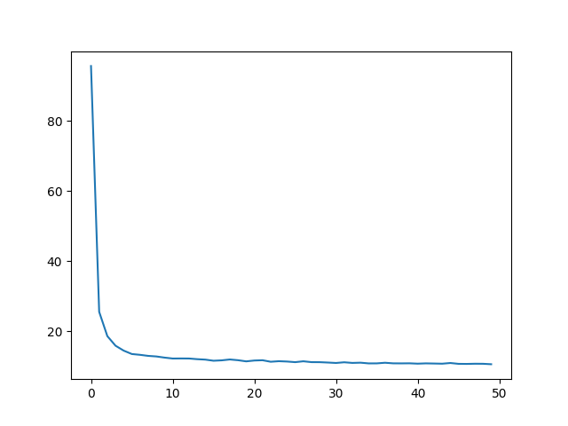
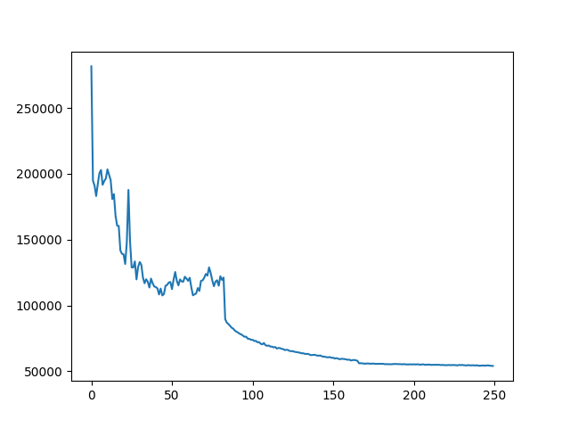

# Incremental-Language-Identification
Train RNN model in PyTorch to identify a language in as few characters as possible

## Languages used
The languages that I trained the model over for this assignment are as follows:

- Urdu
- Arabic
- Persian
- Hindi
- Egyptian Arabic
- Swedish
- Finnish
- Danish
- German
- English.

The first five languages in this list are either very similar to each other (for example Urdu, Hindi and Persian), or/and have very similar roots. I wanted to investigate how difficult it is for a recurrent model to differentiate between them. The first three of the next five languages are Scandanavian, and I wanted to see how well the model can distinguish amongst them, as well as with German and English. My expectations are that the model should not have a hard time differentiating any of the first five languages with the next languages, but it will face more difficulty differentiating amongst the first five or the last five languages.

These languages are specified by their "ISO 369-3" code in the `config.py` file, and you can specify any language here, as well as any number of languages. I have designed the scripts to hopefully be generic enough to be handle this.

### Generating smaller train-test files as per specified languages
The repository contains the following train-test files:

- x_train_subset_langs.txt
- y_train_subset_langs.txt
- x_test_subset_langs.txt
- y_test_subset_langs.txt

These files have been generated as per the languages mentioned above, using the `data_preparation.py` script. If you want to run the project for a different set of languages, please specify the languages in `config.py`, and then run the `data_preparation.py` script to generate the smaller train-test files as per the languages that you have specified.

## Network Architecture
The network architecture is specified in the `GRUNet.py` file. It contains an embedding layer which takes the vocabulary size (this increases as more languages are added of course), and creates embeddings of 200 dimensions, or as specified in `input_size`. These embeddings are then fed to the GRU layer, which has a layer size of 2 and a hidden size of 300, or as specified in `hidden_size`. The output of this layer is finally fed to a linear layer, the output of which is equal to the number of languages specified in `output_size`. I do not apply a Softmax or LogSoftmax function at the end to get prediction probabilities, as the loss function I'm using is CrossEntropyLoss, and it calculates the softmax itself. 

In order to make the network architecture somewhat configurable, I have specified the input size, hidden size, number of layers for GRU, dropout for GRU and learning rate for the optimizer in the `config.py` file, and they can be changed from there to experiment with different configurations.

## Training the model
The main script to train the model is `train_model.py`. It accepts the following command line arguments:

- `-X` --> the path to the file containing the language sentences to be used for training. This is a string value.
- `-Y` --> the path to the file containing the language labels to be used for training. This is a string value.
- `-E` --> the number of epochs to be used for training the model. This is an integer value.
- `-L` --> the loss function to be used for training the model. This is an integer value that can accept a value of 1, 2 or 3. Their functions are as follows:
	- 1 = use normal CrossEntropyLoss without character length factored in
	- 2 = CrossEntropyLoss with character lengths multiplied with respective losses
	- 3 = CrossEntropyLoss with character lengths added to respective losses.

### Specifying batch size
To specify the batch size, you can specify the value in the `BATCH_SIZE` parameter in the `config.py` file. If you don't want to use batches, please set the batch size here to 1. 

### Training process

#### Loading the data
The training of the model happens as follows: First, a language label to integer mapping is created for the languages specified in the config file. Then, data is loaded from the sentence data and sentence label files specified in the command line arguments. While loading the sentences, they are each limited to their first 100 characters. A training and validation split is created on this data, with 80% of the data being used for training, and the remaining 20% to be used for validation. 

#### Generating vocabulary and vocabulary-to-integer mapping
The vocabulary and vocabulary-to-integer mapping is generated using all sentences (training as well as validation). This is to ensure that the validation data doesn't have any characters that there isn't a character-to-integer mapping for. This mapping is initialized from 1 instead of 0, since 0 is reserved for the padding character, and its size is equal to the number of unique characters in the sentences present in the data. 

#### Clipping sentences
Clipped versions of each sentence in the training data are then generated, with the clipping length specified to 100. This means that for each sentence in the training data, 100 sentences are generated, where the first sentence contains only the first character, the second sentence contains only the first two characters, and so on until the length of the sentence (which is always 100 as the sentences are limited to their first 100 characters). This means that we get a lot more training sentences, and the labels are multipled accordingly - I also thought that this can be looked upon as a form of data augmentation, but I'm not too sure about this.

#### Getting numeric representations of sentences
The next step is to get the numeric representations of each sentence, where in each sentence, every character is replaced by its numeric representation as specified in the vocabulary-to-integer mapping. This is a relatively straightforward process, and I have added the condition that if the numeric mapping for any character is not found, then its numeric representation is 0. This is done so that if the test data contains a character for some language that is not present in the training language, it shouldn't contain the script. Additional thoughts: Perhaps this replacement character should not be 0 since that's the padding character, but maybe something like the length of the vocabulary + 1. However, I did not face this scenario in the testing enough to test this altered version of replacement character.

#### Padding sequences
Finally, the numeric representations of sentences are padded using PyTorch's built-in `pad_sequence` function, so we now get sequences of 100 characters length each, where sentences having less than 100 characters are padded to the right by zeros. This is the final transformation done to the data, and it can now be fed into the network for training.

#### Shuffling and generating batches
For shuffling the data and generating batches, I used PyTorch's `DataLoader` functionality. I had to create a separate class for it (specified in `Dataset.py`), which extends `torch.utils.data`, and I overrode the `__init__`, `__len__` and `__getitem__` functions. To use this, I created a generator for the training data using this class, and fed it the padded sequences and labels for the training data. The batch size I specified here is the same that is present in the `config.py` file. Note: I tried implementing batching myself first, but I ran into a lot of problems, and then found that learning how PyTorch's DataLoader functionality was both more convenient, and more efficient.

#### Loss function types
The network is initialized using the configurations specified both in the command line parameters as well as the config file, along with the optimizer and loss function (note that the loss function is initialized with reduction set to 'none' in the case of loss function types 2 and 3), and then it is trained over the batches generated by the training generator. 
	- If the loss function type is 1, I calculate the loss as normal.
	- If the loss function type is 2, I calculate the loss as normal, which returns me the individual losses of all instances present in the specified batch. To each loss value, I multiply the respective character lengths (which I calculate by getting the number of non-zero elements in the padded sequence), and then take the mean of the loss at the end.
	- If the loss function type is 3, loss calculation happens in the same manner as in loss function type 2, except that the character lengths are added to the respective losses instead of being multiplied by them.
The loss values are calculated after each epoch, and are added to a list to be used for plotting the loss later.

NOTE: For the custom loss function types 2 and 3, I also experimented halfway with the idea of creating a separate network which simply takes an input of dimension 1 and returns an output of 1, and updating it through the same loss function. However, I found the other approach (the one I've used) easier, plus as per Asad's comments in the discussion forum for this assignment, "the most likely thing to happen is that LaTeX: mm will tend to 0 as the network learns to ignore the penalty and focus on accuracy", I found it worthwhile to invest in the other approach first.

#### Saving required objects to disk
Finally, the trained model, the vocabulary-to-integer mapping, and the language-label-to-integer mapping are saved to disk. The path and name for these are all specified in the config file, and can be changed.

### Results
Here are the results I got for all three loss functions and their respective models:

|                                  | LF 1   | LF 2   | LF 3     |
|----------------------------------|--------|--------|----------|
| Training Loss                    | 64.266 | 350.02 | 40640.48 |
| Model accuracy                   | 67.46% | 70.77% | 66.93%   |
| Avg no. of chars until hit score | 4.68   | 4.91   | 4.33     |
| Learning rate                    | 0.0005 | 0.0005 | 0.0005   |
| No. of epochs                    | 250    | 250    | 250      |

I found these results quite interesting:
- There is not a lot of difference in the accuracy scores of these models, although it's interesting that LF 2 has the highest accuracy. I would have expected LF 1 to have the highest accuracy, since the other two models also aim to optimize the number of characters until hit score. 
- The training loss of LF 1 being the lowest makes sense, as the other two loss functions aim to optimize two things at once, so it will probably to take them more epochs to get a lower training loss. LF 3 has a ridiculously high training loss at the end of 250 epochs, but while doing this assignment I have learned that initialization matters a lot when working with neural networks. Even though I trained a model using LF 3 twice, it could be that it started off in a bad local minima and never quite made it out of there.
- You may note that the learning rate is quite small. This is because when I experimented with higher learning rates, the loss scores would bounce around a lot and never really converge. Eventually I decided upon a leaning rate of 0.0005, which means that the loss values do not bounce around but steadily converge. However, this convergence happens very slow, which is why we might need a lot more epochs for such a learning rate. I thought that the Adam optimizer might help here, but it didn't. I am trying to experiment with PyTorch's StepLR, which helps adjust the learning rate based on number of epochs, will post the results here if interesting.
- Update: I experimented with PyTorch's StepLR scheduler. I set the initial learning rate to 0.05, and added a gamma of 0.1 and a step size of 83 for 250 epochs. This means that after every 83 epochs, the learning rate will decrease by 0.1, so it will start with a learning rate of 0.05, then it will become 0.005, and then 0.0005. I tried the LF 3 with this functionality, and I noticed that with this configuration, it starts off with a very epoch loss, somewhere around a million. It decreases after that, but I noticed the same fluctuation/bouning around of the epoch loss that I had noticed earlier with a higher learning rate. These are the stats I got with StepLR functionality added into training the model with LF 3:

**Training loss:** 54028.2615547

**Model accuracy:** 60.4722%

**Average number of characters until hit score:** 6.22.

It seems like adding in StepLR made things worse everywhere. Moreover, when I tried training a model with StepLR and LF 1, I started getting nan values for loss after a few epochs. When I searched this up online, the first suggestion was to decrease the learning rate. So I assume that a high learning rate doesn't work well for my network, and StepLR didn't help with the custom loss functions as much as I'd hoped. I ended up commenting out the Step LR functionality.

### Training loss plots
Here are some training loss plots:

**Training Loss with LF 1, no StepLR**

**Training Loss with LF 2, no StepLR**

**Training Loss with LF 3, with StepLR**

## Evaluating the model
In order to run the testing script, we need to have 3 objects saved to disk so that the `test_model.py` script can load them and evaluate the model on the test data: the trained model, the vocab-to-int mapping, and the mapping of language names to language labels. The `test_model.py` script is provided with the following command-line arguments:

- `-X` --> the path to the file containing the language sentences to be used for testing. This is a string value.
- `-Y` --> the path to the file containing the language labels to be used for testing. This is a string value.
- `-M` --> the path to the model that we're supposed to load for testing. This is a string value.

The vocab-to-int mapping and language-names-to-language-mapping objects are specified in the config file, and are loaded from there.

Testing happens a little differently than training. The sentences are loaded from the testing file one by one, and then the preprocessing techniques are applied to each sentence. Clipped versions of the sentence are generated, so we end up with 100 versions of the one sentence; the characters in these clipped versions are replaced by their numeric indices; the numeric sequences are padded so that they are all equal to a size of 100. These padded sequences are fed one by one into the forward pass of the model, starting with the sequence with smallest number of characters, and we compare the output prediction with the actual label. I keep a track of total predictions made, and correct predictions made; this helps us give the accuracy near the end. Additionally, for each correct prediction, I note save number of characters until hit score. However, this I do only once per testing instance, and I do this for the clipped instance of the test sentence that gave a positive prediction. This might seem convoluted to explain, but the code is pretty straightforward. This helps me calculate the avg_chars_until_hit_score, computed over all testing instances.

For each testing instance, I also print out the total number of correct predictions out of the 100 instances for each testing sentence. 

These results are mentioned above, under the "Results" section of the "Training the model" section.

## Final Thoughts
I would have liked to train the model over a larger number of epochs, and compare the training loss and model accuracy of LF 1 and LF 2. LF 3 doesn't seem to be a promising variation on the loss function, and therefore doesn't seem worth investing more time in - although perhaps a different variation of the loss function can be looked into.

Additionally, I was disappointed by how the StepLR scheduler didn't help as I had hoped. Perhaps there was something wrong with my implementation of it.

I also didn't fully manage to figure out the nan loss issue that I sometimes got while training the model over LF 1. I tried adding some conditions to change the loss to a miniscule value like 0.0001 when it is nan, but it didn't seem to help.

Finally, another evaluation metric that I wanted to observe was the average number of characters until hit score for each of the languages specified - maybe I'll add that in later on!